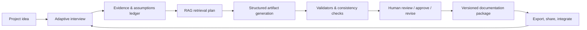
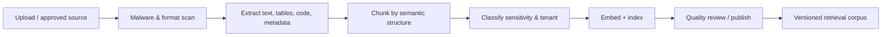
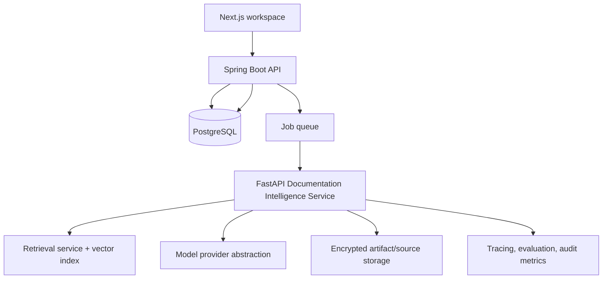

# Velocira Masterclass Product Blueprint

> **Purpose:** Define what Velocira must add to become a genuinely trusted AI documentation workspace—not a text generator that produces plausible-looking files.
>
> **Product promise:** Turn an ambiguous product idea into a traceable, reviewable, standards-aligned documentation set that a real product team can confidently use to build software.

## 1. Executive conclusion

Velocira already has a solid SaaS shell: authentication, projects, documents, audit events, role separation, a typed Spring Boot API, and a Next.js interface. The central value proposition, however, is not yet implemented: a governed AI workflow that discovers intent, retrieves the right knowledge, generates internally consistent artifacts, validates them, lets humans review them, and preserves every decision.

The priority is not to add a long list of document templates. The priority is to build a **Documentation Intelligence Engine** with four properties:

1. **Interview before generation.** The system must resolve ambiguity instead of inventing business rules.
2. **Retrieve before answering.** The LLM must use approved, versioned sources and project evidence rather than rely on memory alone.
3. **Validate before publishing.** Every artifact must pass machine and human quality gates appropriate to its type.
4. **Trace everything.** A requirement, diagram node, endpoint, test, risk, and decision must be linked—not independently generated silos.

If these four properties are delivered well, Velocira can serve students, founders, product managers, and small software teams better than generic chat tools: it produces a coherent engineering package rather than disconnected prose.

---

## 2. Current foundation and the critical gaps

### Already present

- Next.js frontend with authentication, project views, document views, settings, and administration.
- Spring Boot modular backend with JWT authentication, Google authentication, email verification/reset, user/project/document CRUD, audit logging, validation, rate limiting dependencies, Flyway, PostgreSQL, OpenAPI UI, and tests.
- Project and document models with document types, statuses, word counts, and document version counters.
- A documented target architecture of Next.js + Spring Boot + a Python/FastAPI AI service.

### Missing to fulfil the product promise

| Area | Missing capability | Why it matters |
|---|---|---|
| AI core | FastAPI generation service, provider abstraction, prompt/version registry, queues, retries, and result persistence | Current documents are manual placeholders; no real generation occurs. |
| Discovery | Adaptive user interview, completeness scoring, assumptions, contradiction detection, user approval | A single free-text project description cannot reliably establish requirements. |
| RAG | Curated corpus, ingestion pipeline, embeddings/vector search, metadata filtering, citations, evaluation | Standards and domain evidence must be retrieved and attributable. |
| Standards | Canonical artifact schemas, standards packs, quality rubrics, format validators | "Standards-aligned" must be measurable, not only a prompt claim. |
| Consistency | Project knowledge graph and cross-artifact traceability | SRS, use cases, ERD, and API otherwise drift apart. |
| Review | Section-level review, comments, approvals, change requests, version diffs | A deliverable needs human ownership and accountability. |
| Export | Reliable Markdown, PDF, DOCX, diagram, and OpenAPI exports | Documents must travel into real engineering workflows. |
| Delivery | CI/CD, security scanning, observability, backups, production configuration | A SaaS product needs operational evidence—not just local development. |

---

## 3. Product north star and non-negotiable principles

### North-star workflow



### Product principles

- **No silent assumptions.** Any inference that materially affects scope, security, data retention, roles, or costs is labelled as an assumption and shown to the user.
- **Source-aware generation.** Claims sourced from the project or knowledge base include a source reference; generic guidance is clearly labelled.
- **Structured first, prose second.** Generate a typed project model and artifact schema before rendering Markdown/PDF.
- **Human owns decisions.** The LLM proposes; the project owner approves. Approval is recorded with version and timestamp.
- **Fit-for-purpose standards.** Apply a selected standards profile based on project type and risk. Do not pretend every early student project needs full enterprise compliance.
- **Privacy by default.** Tenant data, uploaded evidence, embeddings, prompts, and outputs remain isolated and are not silently used to train models.

---

## 4. Standards and practice framework

Velocira should make standards usable. It should not reproduce copyrighted standards verbatim or claim certification. Store only properly licensed content, public material, or internally authored control summaries; record exact source/version/ownership for each knowledge-base entry.

| Domain | Baseline to operationalize | How Velocira applies it |
|---|---|---|
| Requirements | ISO/IEC/IEEE 29148 requirements engineering | Requirement IDs, stakeholder/source, priority, rationale, acceptance criteria, dependencies, status, and verification method. The standard defines good requirements and requirements life-cycle information. [IEEE 29148](https://standards.ieee.org/ieee/802.1Q/6937/) |
| UML | UML 2.5.1 notation and semantics | Generate use-case, class/domain, sequence, and activity diagrams only from structured model data; validate syntax and keep the diagram source editable. [OMG UML 2.5.1](https://www.omg.org/spec/UML/2.5.1/) |
| Architecture | ISO/IEC/IEEE 42010 concepts plus C4-style views | Maintain context, container, component, deployment, data-flow, quality-attribute, and decision-record views. Never use one picture as “the architecture.” |
| APIs | OpenAPI 3.1.x, JSON Schema, HTTP semantics | Generate contract-first OpenAPI; validate it; derive endpoint tables, examples, errors, auth requirements, and contract tests. OpenAPI provides a language-neutral HTTP API description. [OpenAPI Specification](https://spec.openapis.org/oas/latest.html) |
| Data | ERD notation, normalization guidance, migration safety | Derive ERD from entities/relationships, explain cardinality, keys, constraints, data classification, retention, and migration notes. |
| Security | OWASP ASVS 5.0, OWASP API Security Top 10 2023, threat modeling | Choose ASVS level per project; create abuse cases, threat model, authorization matrix, security requirements, and verification evidence. OWASP ASVS is a secure-development requirements and verification baseline. [ASVS](https://owasp.org/www-project-application-security-verification-standard/) |
| GenAI/RAG safety | OWASP Top 10 for LLM Applications 2025; NIST AI RMF GenAI Profile | Threat-model prompt injection, disclosure, poisoning, output handling, excessive agency, and model drift. RAG does not by itself solve prompt injection. [OWASP LLM01](https://genai.owasp.org/llmrisk/llm01-prompt-injection/) [NIST AI 600-1](https://www.nist.gov/publications/artificial-intelligence-risk-management-framework-generative-artificial-intelligence) |
| Accessibility | WCAG 2.2 AA | Make the generated UX requirements and Velocira UI testable for keyboard, focus, contrast, labels, status messages, and authentication accessibility. [WCAG 2.2](https://www.w3.org/TR/WCAG22/) |
| Quality | ISO/IEC 25010 quality characteristics | Generate measurable quality requirements for reliability, performance efficiency, security, maintainability, compatibility, usability, and portability. |
| Privacy | Data minimization, purpose limitation, retention and deletion controls | Create a data inventory, lawful-use questions, data classification, retention schedule, DSR workflow, and privacy/security risks. Obtain legal review for jurisdiction-specific claims. |

### Standards profile selector

At project creation, ask for product type, domain, data sensitivity, regulated environment, audience, and delivery stage. Choose a profile such as:

- **Starter:** IEEE-style SRS essentials + OpenAPI + basic ERD/use cases; appropriate for student projects and early MVPs.
- **Startup:** Starter + architecture decision records, threat model, non-functional requirements, release plan, test strategy, WCAG 2.2 AA backlog.
- **Professional:** Startup + complete traceability, ASVS L2 target, API security checks, quality attribute scenarios, CI evidence, review approvals.
- **Regulated:** Professional plus a customer-selected control pack. This must be jurisdiction/domain reviewed; Velocira should not market it as compliance certification.

---

## 5. The smart interview: replace the static wizard

### Interview design

The interview is a guided requirements-engineering conversation, not an open chat. It adapts to uncertainty and asks the smallest useful next question. Each answer is stored as evidence and updates a project knowledge model.

1. **Intent and outcome:** What problem exists, for whom, what changes after success, and what is explicitly out of scope?
2. **Actors and journeys:** Who uses or administers the system? What are their top jobs, happy paths, alternatives, and failure paths?
3. **Business rules:** What must always be true? What decisions, approvals, eligibility rules, policies, fees, and limits apply?
4. **Data and integrations:** What data is created/read/changed? Who owns it? What systems, APIs, files, devices, or identity providers are involved?
5. **Quality attributes:** What scale, latency, availability, accessibility, supported devices, localization, security, and privacy targets matter?
6. **Risk and constraints:** What can cause harm, loss, fraud, incorrect advice, or regulatory impact? What budget, deadline, team, and technology constraints exist?
7. **Confirmation:** Present a concise “what we understand” summary, assumptions, conflicts, and gaps. The user confirms or corrects it before generation.

### Adaptive questioning rules

- Ask **one high-value question at a time**; allow “I don’t know” and offer safe, labelled defaults.
- Explain why a question matters in plain language and allow the user to skip it.
- Do not ask a question that can be inferred from an approved answer, except to confirm a high-risk inference.
- Detect contradictions: e.g., “public app” + “only managers can view orders”; “no personal data” + “store email, address, and medical history.”
- Escalate when an answer changes security, privacy, compliance, cost, or architecture.
- Keep a visible **Assumptions & Open Questions** panel with owner, impact, due date, and resolution status.

### Interview completion score

Display a confidence score by category, never a fake “project is complete” percentage:

| Category | Ready when |
|---|---|
| Problem and scope | Users, outcome, exclusions, and success metric are confirmed. |
| Functional model | Core actors, journeys, rules, and edge cases are represented. |
| Data and integrations | Key entities, ownership, classification, and external dependencies are known. |
| Quality and risk | Target quality attributes and material risks have a response. |
| Delivery | Constraints, team assumptions, milestones, and acceptance approach exist. |

Generation may start early, but every output carries a readiness badge and a list of unverified assumptions.

---

## 6. RAG architecture: trusted knowledge, not “search + prompt”

### Corpus types and access rules

| Corpus | Examples | Access and retrieval rule |
|---|---|---|
| Project evidence | Interview answers, uploaded PRDs, existing SRS, meeting notes, code/OpenAPI, approved decisions | Tenant-isolated; highest retrieval priority; citations are mandatory. |
| Approved standards summaries | Internal control summaries, licensed extracts, public official guides | Global, versioned, read-only; retain license/provenance metadata. |
| Domain packs | Healthcare, e-commerce, education, fintech, marketplace patterns | Opt-in; curated and reviewed; distinguish guidance from law. |
| Organization knowledge | Brand, architecture patterns, policies, terminology, reusable templates | Workspace-isolated; owner-controlled; lifecycle/retention policy applies. |
| External sources | User-approved URLs or APIs | Ingest only after provenance/security checks; snapshot, scan, and cite. |

### Ingestion pipeline



Required metadata for every chunk: `tenant_id`, `source_id`, `source_version`, `source_type`, `license`, `classification`, `jurisdiction`, `standard/version`, `artifact_scope`, `language`, `approved_at`, `expires_at`, and a stable citation anchor.

### Retrieval and answer pipeline

1. Interpret the artifact section and current project state.
2. Retrieve project evidence first, then the selected standards/domain packs with metadata filters.
3. Re-rank for authority, recency, relevance, diversity, and tenant permissions.
4. Build a bounded context with source IDs; separate untrusted uploaded content from system instructions.
5. Generate **strict structured output** matching the artifact schema.
6. Run citation coverage, grounding, policy, secret/PII, schema, and consistency checks.
7. Save the response, retrieval set, model/provider, prompt version, validator results, and user approval as a reproducibility record.

### RAG safety controls

- Treat retrieved text as **data, never instructions**. Clearly delimit it in the prompt.
- Do not grant an LLM arbitrary network, shell, database, or export permissions. Tool calls use allowlisted tools and server-side authorization.
- Scan uploads and retrieved content for prompt injection indicators; flag suspicious passages; do not rely on detection alone.
- Enforce tenant and document-level authorization before retrieval and before every tool call.
- Redact secrets and sensitive personal data before embedding where possible; support deletion from raw storage, indexes, caches, and logs.
- Protect against poisoned sources with provenance, human approval for public knowledge, versioning, rollback, and evaluation sets.
- Require citations for factual/product-specific claims; show “Not enough evidence” rather than fabricate a source.

---

## 7. Canonical project model and traceability

Generation should operate on a canonical, versioned project model—not only Markdown. The model becomes the single source of truth from which artifacts render.

### Core entities

```text
Project
├── Stakeholder / Persona / Actor
├── Goal / Metric / Constraint / Assumption / Decision
├── Requirement (functional, quality, security, privacy)
├── Use case / User story / Business rule / Acceptance criterion
├── Domain entity / Attribute / Relationship / Data classification
├── API operation / Schema / Error / Authorization policy
├── Architecture element / Interface / Deployment node / ADR
├── Risk / Threat / Control / Test case
├── Artifact / Section / Revision / Comment / Approval
└── Source citation / Retrieval run / Generation run
```

Every object needs a stable ID and lifecycle status. Example trace chain:

```text
Goal G-01
  → Requirement FR-014
  → Use case UC-07
  → API operation POST /orders
  → Data entity Order
  → Threat T-04
  → Security control SC-09
  → Acceptance test AT-033
  → Release milestone M-02
```

### Required traceability checks

- Every functional requirement has at least one acceptance criterion and verification method.
- Every API operation maps to a user-facing use case or explicit integration requirement.
- Every stored data entity has an owner, classification, retention rule, and access rationale.
- Every high/critical risk has a treatment decision and owner.
- Every diagram node references a canonical object ID.
- A changed requirement reports affected documents, API endpoints, data entities, tests, and risks before publication.

---

## 8. Masterclass artifact suite

### Foundation package (first release)

| Artifact | Masterclass criteria | Machine validation |
|---|---|---|
| Product brief | Problem, target user, value proposition, scope, success metrics, constraints, risks | Required fields and no conflicting scope statements. |
| SRS | IEEE-style requirements; IDs, priorities, rationale, acceptance criteria, NFRs, assumptions, glossary, traceability | Requirement schema, duplicate/conflict detection, testability rubric. |
| Use-case package | Actors, preconditions, triggers, main flow, alternate/exception flows, postconditions, business rules | Cross-reference actor/rule IDs; UML/diagram syntax. |
| Domain & ERD | Entities, attributes, keys, cardinality, constraints, lifecycle, data classification | ERD syntax, key/cardinality checks, orphan entity detection. |
| API design | OpenAPI contract, endpoint rationale, schemas, auth, pagination/filtering, idempotency, errors, examples | OpenAPI linting/validation, schema examples, security schemes. |
| Architecture pack | Context/container/component/deployment views, ADRs, integration/data flows, quality attribute scenarios | Diagram syntax and reference integrity. |
| Test strategy | Unit/integration/E2E/contract/security/accessibility/performance test plan linked to requirements | Coverage and traceability report. |
| Delivery plan | Milestones, dependency/risk register, estimate assumptions, release/readiness checklist | Dependency/capacity consistency checks. |

### High-value differentiators (after foundation)

- **Consistency copilot:** “Changing guest checkout affects 14 requirements, 3 endpoints, 2 ERD entities, 5 test cases, and one privacy decision.”
- **Evidence mode:** Review pane shows exactly which interview answers, uploads, and standards controls informed a paragraph.
- **Two-audience rendering:** one editable technical document plus an executive summary derived from the same canonical data.
- **Artifact health score:** score by completeness, traceability, testability, source coverage, and unresolved risk—not word count.
- **Review simulator:** run personas (security reviewer, backend lead, UX/accessibility reviewer, product owner) against a document and return actionable questions, not generic praise.
- **Code-to-doc reverse engineering:** import a repository/OpenAPI/database schema to produce an “as-is” baseline, compare it with the “to-be” specification, and surface drift.
- **Design-to-doc import:** read approved Figma metadata/screens (with permission) to build UI requirements and accessibility checkpoints.
- **Integration pack:** GitHub/Jira/Linear/Notion export or sync with human-approved mappings; do not silently create tickets.
- **Domain playbooks:** education, marketplace, healthcare, SaaS, logistics, and fintech packs that add targeted questions, risks, terms, and templates.
- **Multilingual review:** generate in a selected language while retaining a canonical terminology glossary and showing translation confidence/required human review.

---

## 9. Generation architecture and reliability

### Recommended architecture



### Important implementation decisions

- **Asynchronous jobs:** document generation must be a queued job with idempotency key, progress events, cancellation, retry policy, timeout, dead-letter handling, and a user-visible failure reason.
- **Provider abstraction:** hide model SDKs behind a server-side interface. Store provider/model/version/cost/latency per run. Use a fallback only when it preserves data-residency and quality requirements.
- **Structured output:** request JSON matching a versioned schema, validate server-side, then render. Never parse fragile “markdown that looks like JSON.”
- **Object storage:** put raw uploads and rendered exports in encrypted object storage; PostgreSQL stores metadata, relationships, and version references.
- **Observability:** use correlated IDs from browser action → API → generation job → retrieval run → model call → artifact revision.
- **No client-side provider keys:** LLM keys, vector-store credentials, and export credentials stay on the server or in a managed secret store.

### Suggested persistence additions

`generation_jobs`, `generation_runs`, `prompt_templates`, `artifact_schemas`, `artifact_versions`, `artifact_sections`, `citations`, `source_documents`, `source_chunks`, `knowledge_collections`, `retrieval_runs`, `interview_sessions`, `interview_answers`, `assumptions`, `decisions`, `requirements`, `trace_links`, `comments`, `approvals`, `risk_register`, `evaluations`, and `security_events`.

---

## 10. Quality gates and evaluation

### Release gate for each generated artifact

1. **Schema gate:** valid structured output, expected fields, stable IDs, no unparsed content.
2. **Evidence gate:** project-specific claims cite evidence; unverified ideas are marked as assumptions.
3. **Standards gate:** selected profile checklist is satisfied or exceptions are explicit.
4. **Consistency gate:** no broken IDs; terminology and business rules agree across artifacts.
5. **Type-specific gate:** OpenAPI/JSON Schema validation, diagram parser, Markdown/PDF export check, or ERD cardinality check.
6. **Safety gate:** secret/PII scanning, harmful instruction handling, output encoding/sanitization, tenant authorization.
7. **Human gate:** owner reviews critical sections and accepts, edits, or returns them with feedback.

### Evaluation program

Build a private, consented evaluation set of anonymized project briefs representing different domains and complexity levels. Score every model/prompt/RAG change against it before deployment.

| Dimension | Example metric |
|---|---|
| Groundedness | % of project-specific claims correctly supported by retrieved project evidence. |
| Requirement quality | % judged atomic, unambiguous, feasible, testable, and traceable. |
| Consistency | Broken trace links, conflicting rules, and orphaned API/ERD objects per artifact. |
| Coverage | Required sections/controls completed for selected standards profile. |
| User value | Time to an approved first draft; acceptance/edit/reject rate by section. |
| Safety | Prompt-injection resistance, unauthorized retrieval attempts blocked, sensitive-data leakage rate. |
| Reliability | Job success rate, p95 time to first useful draft, retry/failure reasons. |
| Cost | Cost per approved artifact and retrieval/model cost split. |

Do not use “the output sounded good” as an evaluation method. Run blinded expert review for a representative sample and track regression over time.

---

## 11. Security, privacy, and trust plan

### Immediate engineering hardening

- Remove development credentials from `backend/compose.yaml`; use environment variables and a secret manager. Rotate any credential that has been committed or shared.
- Lock production CORS to explicit frontend origins; keep dev origins separate by environment.
- Add dependency, secret, static analysis, container/image, and infrastructure scanning to CI.
- Verify authorization at every resource lookup and nested document endpoint; add negative tests for cross-tenant and cross-project access.
- Use short-lived access tokens, refresh-token rotation/revocation, secure cookie settings where cookies are used, and account/session management tests.
- Restrict Actuator, API documentation, admin, and operational endpoints by environment and authorization.
- Add structured audit events for privileged actions, exports, sharing, source ingestion, generation, approval, and deletion.
- Define backup/restore objectives; test restoration rather than only taking backups.

### AI/RAG-specific security requirements

- Per-tenant retrieval authorization and row/document-level isolation.
- No model provider training on customer data unless an organization explicitly opts in under a documented agreement.
- DLP/redaction policy before model calls and embedding; documented exceptions for content necessary to create the artifact.
- Prompt injection test suite covering user input, uploads, web imports, and retrieved documents.
- Sanitized Markdown/HTML rendering and safe export pipeline to prevent stored XSS or malicious link/image behavior.
- Content provenance, source version, user visibility, and retention/deletion controls.
- Incident response path for bad output, data leakage, poisoned corpus content, and compromised provider credentials.

OWASP’s API Top 10 highlights object-level authorization, authentication, property authorization, resource consumption, sensitive business flows, SSRF, inventory, and unsafe third-party API consumption—directly relevant to this multi-tenant SaaS. [OWASP API Security Top 10](https://owasp.org/API-Security/)

---

## 12. UX that earns trust

- Show the interview, assumptions, sources, generated artifacts, validation results, and approvals in one project workspace.
- Enable section-level regenerate/edit/compare rather than “regenerate the whole document.” Preserve human edits; never overwrite them silently.
- Show a “why this exists” drawer for a requirement, including related goal, evidence, decision, source, and downstream impact.
- Use clear generation states: queued, retrieving, drafting, validating, needs input, ready for review, failed. Do not show invented percentage progress.
- Offer an accessible review experience: semantic headings, keyboard navigation, focus management, visible validation errors, non-color-only status, and responsive diagrams. Target WCAG 2.2 AA.
- Allow an empty starting point and import path; advanced teams should be able to start from an existing SRS, API, or repository rather than repeat an interview.
- Explain confidence carefully: use evidence coverage and unresolved questions, not a claim that the system “knows” the user’s business.

---

## 13. Ten-phase execution roadmap

This is intentionally a **sequence**, not a wish list. Do not begin a later phase until the exit gate of the prior phase is met. The first five phases produce a usable, secure MVP; phases six through ten create the differentiated, masterclass platform.

### How to use this roadmap in future work

For a future implementation request, specify the phase number and the deliverable(s) you want built. The phase handoff tells the implementing team what is authorized, which artifacts must be updated, and how to prove completion.

| Stage | Phase | Outcome | Indicative duration |
|---|---:|---|---:|
| MVP | 1 | Production-safe project/documentation foundation | 2 weeks |
| MVP | 2 | Reliable asynchronous AI generation backbone | 2–3 weeks |
| MVP | 3 | Smart requirements interview and approved project brief | 3 weeks |
| MVP | 4 | Evidence-grounded RAG and standards-aligned SRS | 3–4 weeks |
| MVP | 5 | Linked core document package, export, and MVP release | 3–4 weeks |
| Masterpiece | 6 | Living documentation, review, collaboration, and change impact | 3–4 weeks |
| Masterpiece | 7 | Standards studio, deep validation, and expert quality controls | 3–4 weeks |
| Masterpiece | 8 | Engineering workflow integrations and reverse documentation | 4–5 weeks |
| Masterpiece | 9 | Enterprise-grade trust, scale, operations, and domain packs | 4–6 weeks |
| Masterpiece | 10 | Adaptive documentation intelligence and ecosystem leadership | Continuous, first release 4–6 weeks |

### Phase 0 — codebase truth audit and cleanup (complete before Phase 1)

**Objective:** Remove simulated behavior, stale claims, configuration hazards, and misleading completion states so later phases build on a truthful baseline.

**Why this phase exists:** The initial codebase contains a capable authentication/project/document foundation, but several UI flows had been presented as complete while being static demos or client-side simulations. Building RAG or generation on those flows would hide failures and corrupt the MVP acceptance criteria.

**Required cleanup checklist**

| Area | Required state before Phase 1 |
|---|---|
| Project creation | Creates a persisted project through the backend and navigates to its real ID. No fabricated ID, timer, or “generation complete” progress. |
| Project detail | Loads only the requested project and its stored documents from the API. No canned project, healthcare example, generated document, API, ERD, or compliance claim. |
| Generation/export | No control, status, progress bar, documentation page, or public copy says generation/export is available until a durable backend job and export pipeline exist. |
| Status/admin | No invented uptime, incident history, health, report export, or server log action. Real analytics may remain when sourced from the backend. |
| Settings/contact | Remove non-persisted security/preferences/notification toggles and simulated contact success. Retain only controls backed by an endpoint. |
| Public copy/legal | Remove invented customer stories, pricing, SLAs, production certifications, feature lists, support promises, and legal promises that rely on unbuilt functionality. |
| Configuration | No default database password, JWT secret, mail credential, or placeholder provider credential can be used as a production configuration. Add a non-secret environment example. |
| Quality gate | Frontend type check/lint and backend tests run cleanly; known limitations are visible in the product and in this blueprint. |

**Phase 0 completion evidence in this repository**

- The project wizard now calls the real project API and labels generation as unavailable rather than displaying simulated progress.
- The project detail route now reads the selected project and document summaries from backend APIs; the hard-coded MediSync content was removed.
- The landing, status, settings, admin, public feature/pricing/documentation/contact/about/career, privacy, and terms routes no longer claim unimplemented features or show mock service data. Unpublished areas explicitly state their status.
- The hard-coded Docker/database password and production-like JWT/mail defaults were removed; `backend/.env.example` documents required configuration without exposing a secret.
- The frontend lint errors in the landing/navbar/cursor components were removed; backend tests provide a passing baseline.

**Known, honest limitations after Phase 0**

- The backend supports document records and manual updates, but it does not yet run an AI generation job, retrieve RAG sources, produce exports, or offer collaboration.
- The persisted project lifecycle and archival state are ready, but no generation job runner exists yet; generation transitions will only be used by a durable job service in Phase 2.
- A public monitoring feed, billing, support intake, and final legal notices are intentionally not published until their underlying operations exist.

**Exit gate:** Every visible capability must either execute against a real persisted/backend service or be clearly marked unavailable. There must be no demo data in authenticated project/document/admin paths and no simulated success path that a user can mistake for a completed product action.

**Future handoff:** “Verify Phase 0 is complete, then begin Phase 1. Do not reintroduce simulated generation, fake telemetry, or unsupported public claims; add a test for every newly exposed action.”

### Phase 1 — secure foundation and honest project workspace (MVP) — implemented

**Objective:** Turn the current SaaS shell into a production-safe base with real project data, reliable configuration, and no misleading placeholder experience.

**What is missing now**

- Production configuration discipline: secrets management, separate development/staging/production settings, and safe database credentials.
- Full application-level authorization and negative tests for cross-user/cross-project access.
- A clear project state model: draft, discovery, ready for generation, generating, needs review, approved, failed, archived.
- CI quality gates and operational basics: lint/type/test/build, migration test, dependency/secrets scanning, health checks, backups, and restore rehearsal.
- A dashboard and project workspace that only present real data and meaningful system states.

**Implementation scope**

| Layer | Deliverables |
|---|---|
| Frontend | Project list/detail empty, loading, error, and permission states; no demo metrics; global error boundary; accessible notification pattern. |
| Backend | Explicit project lifecycle enum/transitions, environment-specific CORS/configuration, authorization test matrix, API error contract, paginated/sorted project list. |
| Data | Harden Flyway migrations; add soft archive/audit fields where required; automated migration test against clean database. |
| DevSecOps | `.env.example` without secrets, secret rotation plan, CI pipeline, SAST/dependency/secret scan, container scan, uptime/health check. |

**Definition of done**

- A newly registered user can create, view, edit, archive, and delete only their own project.
- No real secret is committed; production configuration cannot start with development defaults.
- API security tests cover unauthenticated, wrong-role, wrong-user, malformed-ID, and rate-limited paths.
- CI runs successfully on a clean clone and blocks a broken build, failing test, or detected secret.
- Dashboard/project pages contain no hard-coded project/activity/statistics data.

**Completion evidence (2026-07-24)**

- Added the persisted lifecycle: `DRAFT`, `DISCOVERY`, `READY_FOR_GENERATION`, `GENERATING`, `NEEDS_REVIEW`, `APPROVED`, `FAILED`, and reversible `ARCHIVED`; existing `COMPLETE` records migrate to `APPROVED`.
- Added project archive/restore endpoints, archive metadata, lifecycle transition validation, owner-scoped paging/search/sorting, and API security tests for unauthenticated, cross-user, wrong-role, malformed-ID, and rate-limited paths.
- Added explicit development/production CORS profiles, required runtime credentials, a non-root backend container image, CI quality/migration checks, scheduled secret/dependency/container scanning, and secret-rotation plus backup/restore runbooks.
- Verified locally with frontend lint/type/production build and backend tests (95 passing).

**Future handoff:** “Implement Phase 2: asynchronous generation platform. Preserve the Phase 1 project lifecycle and ownership checks; only a trusted worker may move a project into and out of `GENERATING`.”

---

### Phase 2 — generation platform and job reliability (MVP) — implemented

**Objective:** Build the technical path that can safely turn an approved generation request into a persisted artifact. This phase creates the AI plumbing; it does not yet promise high-quality standards content.

**What is missing now**

- FastAPI AI service, provider abstraction, secure server-side model calls, and model configuration.
- Asynchronous job execution, idempotency, cancellation, retry/backoff, timeouts, and dead-letter/failed-job handling.
- Document generation lifecycle, progress events, artefact persistence, and reproducibility records.
- Correlated traces from browser action through API/job/retrieval/model/export.

**Implementation scope**

| Layer | Deliverables |
|---|---|
| Backend | `POST /projects/{id}/generation-jobs`, job status/cancel endpoints, idempotency key, authorization, rate/cost guardrails, event publication, job worker integration. |
| AI service | FastAPI health/readiness endpoints, typed request/response schemas, provider interface, structured-output adapter, retry classifier, content-safety/error taxonomy. |
| Data | `generation_jobs`, `generation_runs`, `prompt_templates`, `artifact_versions`; immutable input/output metadata, provider/model/prompt version, latency, token/cost fields. |
| Frontend | Generate button with explicit state machine (queued/retrieving/drafting/validating/needs-input/ready/failed), cancel/retry action, no fake percentage progress. |
| Observability | Correlation ID, structured logs, traces, error alert, job queue depth, success/failure/latency/cost dashboard. |

**Definition of done**

- An authorized user can generate one small structured test artifact asynchronously and see its final status after page refresh.
- Retrying the same request does not create duplicate documents or charge duplicate work.
- Provider failure, invalid output, timeout, cancellation, and restart are handled with a durable final state and helpful user message.
- No provider key or raw privileged credential reaches the browser.
- Every completed artifact records the exact input snapshot, model/provider, prompt version, time, and validator outcome.

**Completion evidence (2026-07-24)**

- Added an isolated `ai-service` FastAPI boundary with liveness/readiness endpoints, a typed internal generation contract, deterministic credential-free local provider, structured-output validation, content-safety checks, retry classification, correlation propagation, and four passing API tests. The public browser never receives a provider key.
- Added Flyway V4/V5 and the durable evidence ledger: `generation_jobs`, `generation_runs`, versioned server-side prompt templates, and immutable `artifact_versions`. Each successful artifact records the frozen project/request snapshot, prompt checksum/version, provider/model, validation result, token/cost data, latency, and generation time.
- Added authenticated owner-scoped Spring endpoints for job creation/listing/get/cancel/retry. Initial and retry requests use idempotency keys; a repeated request resolves to the existing job, active work for the same artifact is reused, and a retry creates a separately auditable job from the original immutable snapshot.
- Added a bounded asynchronous worker, delayed exponential retry scheduling, cancellation that prevents late provider output from publishing, restart recovery for stale jobs, a durable failed-job state, rate/concurrency/cost admission guards, audit events, and safe client error messages.
- Added the real project-workspace state machine (`QUEUED`, `RETRIEVING`, `DRAFTING`, `VALIDATING`, `NEEDS_INPUT`, `READY`, `FAILED`, `CANCELLED`) with polling, refresh persistence, cancel/retry actions, and no simulated percentage. Phase 2 deliberately permits only the small SRS test artifact from early project states; Phase 3 adds the strict discovery/readiness gate.
- Added correlation IDs through browser/API/job/worker/FastAPI logs, Actuator health/metrics for queue depth, throughput, failure classes, latency, and cost, plus the [generation operations runbook](../backend/ops/GENERATION_OPERATIONS.md) with local-stack and alert guidance.
- Verified the Spring/JPA/async integration path with `GenerationJobLifecycleIntegrationTest` (3 passing: successful idempotent publication, timeout/backoff/manual retry, and cancellation). The FastAPI suite passes 4 tests.

**Known, honest limitations after Phase 2**

- The checked-in FastAPI provider is deterministic test content only. A real provider adapter, secret-manager integration, model evaluation, and standards-quality output are intentionally deferred.
- There is no RAG corpus, adaptive interview, standards profile, citation engine, or high-quality SRS validator yet. `READY` means the Phase 2 platform artifact was safely persisted, not that it meets IEEE/OWASP/UML quality standards.
- Distributed tracing export and a shared multi-instance rate-limit store are not yet configured; this phase provides durable correlation IDs, structured logs, and Actuator metrics as the operational base.

**Future handoff:** “Implement Phase 3: adaptive discovery interview. Build the persistence model and deterministic readiness rules first, then integrate the LLM question planner behind typed schemas. Preserve Phase 2 immutable job snapshots and prohibit standards-quality generation until the user has approved a complete brief.”

---

### Phase 3 — adaptive discovery interview and project brief (MVP — implemented)

**Objective:** Replace the static project wizard with a requirements-engineering interview that understands what the user wants before drafting documents.

**Implementation evidence (2026-07-24)**

- Added Flyway V6 and durable, owner-scoped `interview_sessions`, immutable answer revisions, `assumptions`, `open_questions`, and `decisions`. The session stores a versioned canonical brief and a deterministic readiness snapshot; evidence is never overwritten when an answer is edited.
- Added authenticated APIs to start/resume discovery, record/revise an answer, read the canonical summary and answer history, confirm the brief, and reopen it. Every endpoint enforces project ownership.
- Replaced the static new-project wizard with a lightweight problem-first workspace. The project detail page runs a one-question interview with “why we ask,” explicit unknown/skip choices, editable answer return paths, a live brief, and visible blockers/assumptions.
- Added a server-owned catalog covering stakeholders, problem, users/actors, scope, exclusions, workflows, rules, entities, integrations, quality targets, constraints, risks, and metrics. Deterministic rules identify missing/unknown high-risk categories and a narrow constraints-versus-integrations conflict; they never invent a business rule.
- Added the typed internal FastAPI discovery planner schema and endpoint. The optional Gemini selector may choose only an unanswered catalog key; the backend retains authoritative wording and falls back deterministically if a key, quota, or provider is unavailable.
- Generation is now gated: a project must have a confirmed brief with no material blockers and be in `READY_FOR_GENERATION`. Confirming a brief with explicit unknowns is allowed, but the project remains in discovery and generation stays locked.
- Added development-only Gemini configuration: `gemini-3.6-flash` primary, `gemini-3.5-flash` fallback, server-side `GEMINI_API_KEY`, and a local Qdrant Compose service. Phase 4 now owns the governed indexing boundary.
- Verified with two discovery integration tests, four generation lifecycle tests, three generation API security tests, five FastAPI tests, frontend TypeScript, and frontend lint.

**Remaining validation before claiming the full Phase 3 product definition of done**

- The requested ten representative project briefs still need human expert review; a code test cannot substitute for requirements-engineering judgment.
- Gemini is implemented behind a credential-free deterministic fallback, but no real Gemini key/free-tier behavior has been exercised in this workspace yet.
- Real Gemini/Qdrant behavior still needs a non-sensitive Docker integration exercise; the automated suite remains deterministic and does not use a real provider key.

**Implementation scope**

| Layer | Deliverables |
|---|---|
| Product/UX | Conversational interview with one high-value question at a time, “why we ask” help, skip/unknown option, editable summary, and branch/return navigation. |
| Backend | `interview_sessions`, `interview_answers`, `assumptions`, `open_questions`, `decisions`; endpoints for answer, summary, confirm, reopen, and evidence history. |
| AI service | Question-planning prompt/schema; risk-aware question selection; contradiction/gap classifier; no business-rule invention without an assumption label. |
| Canonical model | Stakeholders, goals, scope, exclusions, actors, workflows, business rules, entities, integrations, quality targets, constraints, risks, metrics. |
| Validation | Required-category readiness checks and a deterministic rule layer for obvious contradictions; LLM suggestions remain reviewable. |

**Definition of done**

- The interview identifies problem, users, scope/exclusions, core workflows, data/integrations, quality goals, constraints, and risks—or explicitly marks them unknown.
- The user can approve a generated project brief, edit any answer, and see affected assumptions/questions.
- No artifact can be labelled “ready for review” while material unanswered/high-risk questions are hidden.
- At least ten representative project briefs pass through the interview with documented expert review of questions and summaries.

**Future handoff:** “Implement Phase 4: governed RAG and SRS quality engine. Use the confirmed canonical brief as a frozen generation input; add Qdrant ingestion only with tenant boundaries, source provenance, consent, and retrieval/citation evaluations.”

---

### Phase 4 — governed RAG and SRS quality engine (MVP — implemented with launch validation remaining)

**Objective:** Produce the first genuinely valuable document: a cited, standards-profiled, reviewable SRS grounded in confirmed project evidence and approved knowledge.

**Implementation evidence (2026-07-24)**

- Added Flyway V7, owner/project-scoped evidence sources, citable chunks, versioned internal standards profiles, SRS versions, requirements, and requirement-to-evidence trace links.
- Added text/Markdown/JSON upload scanning, review-before-indexing, source quarantine for credential-like or prompt-override content, deletion propagation, and Qdrant payload filtering by owner and project.
- Added a bounded FastAPI retrieval/SRS contract. The model receives only a confirmed brief, the selected internal control summary, and approved retrieval hits; raw source text is treated as data, never instruction.
- Added strict structured SRS validation for requirement ID, priority, acceptance criteria, source/assumption labelling, verification method, citation membership, duplicate IDs, atomic/testable language, and credential-like output.
- Added a project workspace source drawer, Starter/Startup profile checklist, generation/review controls, visible citations/assumptions, version selection, approval, and request-change state.
- Added automated tests for defense-in-depth tenant filtering and prompt-injection blocking. Spring compilation, FastAPI tests, and frontend type/lint checks pass.

**Remaining launch validation**

- Conduct the ten-brief expert panel and define launch thresholds for groundedness, requirement quality, and latency.
- Exercise real Gemini embeddings and Qdrant through Docker with non-sensitive sample data; tests use deterministic vectors and mocked vector responses.
- Add standards/domain packs only with a recorded licence, owner, effective date, expiry/deletion policy, and approved concise control summary.

**Original gap checklist (now addressed in the MVP implementation)**

- Tenant-isolated source ingestion, parsing, chunking, metadata, embeddings, retrieval, re-ranking, and citation persistence.
- Approved standards/domain knowledge packs with version, licence, owner, and effective date.
- Strict SRS schema, requirement quality rubric, source coverage checks, and “not enough evidence” behavior.
- RAG threat controls for prompt injection, poisoned content, sensitive-data disclosure, and untrusted-source instruction following.

**Implementation scope**

| Layer | Deliverables |
|---|---|
| Knowledge pipeline | Upload scan, extraction, semantic chunking, classification, tenant/workspace ACL, embedding/indexing, version/expiry, deletion propagation, source review/publish workflow. |
| Retrieval | Project evidence first; filtered standards/domain retrieval second; relevance/authority/diversity re-ranking; citation anchors returned with every usable source. |
| AI service | Structured SRS generator that accepts only approved brief + bounded retrieval context; requirements include ID, priority, rationale, acceptance criteria, source/assumption, and verification method. |
| Validation | JSON/schema validation, duplicate/conflict checks, atomic/testable requirement rubric, citation coverage score, trace-link creation, secrets/PII/output-safety scan. |
| Frontend | Source drawer, evidence/assumption labels, standards-profile checklist, regenerate section, compare version, approve/request-change controls. |

**Definition of done**

- A user can ingest approved project evidence, select a Starter/Startup standards profile, and receive a structured SRS with visible sources and assumptions.
- Retrieval never returns another tenant’s data; automated tests prove this.
- Prompt-injection examples in user uploads cannot change system/tool authority or expose protected data.
- Requirements are machine-checked for IDs, acceptance criteria, priority, source/assumption, and verification method.
- A small expert panel evaluates a fixed set of briefs; all launches meet a predefined groundedness, requirement-quality, and latency threshold.

**Future handoff:** “Implement Phase 4: governed RAG and SRS engine. Do not ingest copyrighted standards without a licence; begin with project evidence and concise internal standards control summaries.”

---

### Phase 5 — core linked documentation package and MVP release (MVP)

**Objective:** Deliver the MVP promise: generate a coherent package of SRS, use cases, ERD, and API contract from one approved project model, then export and review it end-to-end.

**Implementation update (2026-07-25):** The linked-package core is implemented: an approved SRS produces a versioned canonical model, SRS/use-case/ERD/OpenAPI/traceability artifacts, validation results, immutable exports, and a project-workspace review flow. The Phase 5 release gates that require a real staging environment, accessibility browser smoke test, and pilot users remain mandatory manual evidence; see `PHASE_5_MVP_RELEASE_RUNBOOK.md`.

**What is missing now**

- Canonical object model and traceability links across four artifact types.
- Diagram source generation and validation, OpenAPI contract generation/linting, and reliable export renderers.
- Cross-artifact consistency checks and end-to-end release quality evidence.
- A credible MVP onboarding, documentation, support, and deployment path.

**Implementation scope**

| Layer | Deliverables |
|---|---|
| Canonical model | Stable IDs for actors, requirements, rules, entities, relationships, API operations, schemas, testable acceptance criteria, and trace links. |
| Artifact generation | Use-case narratives + editable UML source; ERD + editable diagram source; OpenAPI 3.1.x + endpoint reference; all generated from the same objects, not separate prompts. |
| Validators | UML/diagram syntax parser, ERD cardinality/key checks, OpenAPI linter/schema validator, broken-reference checker, terminology and business-rule conflict report. |
| Export | Versioned Markdown, PDF, DOCX, diagram source/image, and OpenAPI JSON/YAML; export job record and downloadable immutable package. |
| Release | Staging deployment, accessibility smoke test, E2E tests, error monitoring, user onboarding, support/feedback route, MVP runbook. |

**Definition of done**

- One approved requirement traces to at least one use case, ERD element or data rule where relevant, API operation, acceptance criterion, and source/assumption.
- Generated OpenAPI validates; diagrams compile; exports are visually verified and retain the right version.
- A user completes: create project → interview → approve brief → generate package → review/edit → export package.
- E2E flow is monitored in staging, security/accessibility smoke-tested, and tested with pilot users before release.

**MVP release boundary:** Do not delay this release for live collaboration, code import, broad integrations, billing, or every compliance pack. The MVP wins by making one linked, trustworthy package exceptionally well.

**Future handoff:** “Implement Phase 5: core documentation package and MVP release. Preserve the canonical model and block release until traceability, diagram/OpenAPI validation, and exported-package E2E tests pass.”

---

### Phase 6 — living documents, collaboration, and controlled change (Masterpiece)

**Objective:** Evolve a generated package into a shared, living source of truth that survives real team change.

**What is missing now**

- Workspace/team model, invitations, granular project roles, comments, mentions, review requests, approvals, and share controls.
- Immutable revisions, section diffs, rollback, change sets, and audit-grade approval history.
- Change impact analysis and a workflow that prevents accidental overwrite of human edits.

**Implementation scope**

- Add organization/workspace, membership, project roles (`OWNER`, `EDITOR`, `REVIEWER`, `VIEWER`), share links with expiry, and export permissions.
- Add comments tied to section/object IDs, review states, approval policies, @mentions, notifications, and resolved/unresolved threads.
- Store immutable artifact revisions and human/AI authorship; show side-by-side semantic diffs, not only text diffs.
- Add change-set workflow: propose a requirement/data/API change → show impacted links → user selects regenerate/review tasks → publish one reviewed revision.
- Preserve manual edits as protected content unless the user explicitly accepts a generated replacement.

**Definition of done**

- Two users with distinct roles can review the same artifact without unauthorized edits or data exposure.
- A changed requirement produces an impact report before downstream regeneration.
- Every approval/export/share/delete action is auditable by actor, time, version, and affected objects.
- A user can restore a prior revision without breaking trace links.

**Future handoff:** “Implement Phase 6: collaboration and controlled change. Start with roles/revisions/audit, then comments and impact analysis; do not introduce real-time co-editing until conflict handling is designed.”

---

### Phase 7 — standards studio and expert quality controls (Masterpiece)

**Objective:** Make Velocira a configurable standards workspace where quality is demonstrable, profile-driven, and reviewable by specialists.

**What is missing now**

- A standards-profile editor, control mapping, version/effective-date management, and documented exceptions.
- Architecture, threat-model, test-strategy, ADR, risk, privacy, accessibility, and release-readiness artifacts.
- Deep quality checks beyond “the generated prose looks complete.”

**Implementation scope**

- Build a standards registry containing profile, control ID, source/version/licence, guidance summary, artifact mapping, validation rule, reviewer role, and exception process.
- Add profiles: Professional Engineering, Security-First (OWASP ASVS/API), Accessible Product (WCAG 2.2 AA), and custom workspace profile.
- Generate linked architecture views, ADRs, data-flow diagrams, STRIDE-style threat model, authorization matrix, risk register, test strategy, accessibility requirements, and operational readiness checklist.
- Add policy-as-code checks where deterministic; use expert-review queues where a rule cannot be automated.
- Produce a compliance/quality evidence bundle that says “aligned with selected controls,” not “certified compliant.”

**Definition of done**

- A project can select a profile, see every required/recommended control, and record pass/fail/exception/evidence status.
- Security/privacy/accessibility requirements are connected to risks, architecture, test cases, and approval status.
- An expert reviewer can identify exactly what control a section satisfies and which evidence supports it.
- Profile/version updates do not silently change an approved artifact; they open a visible upgrade/change set.

**Future handoff:** “Implement Phase 7: standards studio. Begin with a data-driven registry and one Professional Engineering profile; add controls only when their source/licence and validation method are known.”

---

### Phase 8 — engineering intelligence and workflow integrations (Masterpiece)

**Objective:** Connect documentation to the systems that build software and make Velocira valuable even when a team already has code and tools.

**What is missing now**

- Importers for repositories, OpenAPI specifications, database schemas, issue trackers, and design sources.
- “As-is” to “to-be” comparison, documentation drift detection, and human-approved synchronization.
- Contract-test/project-management export that respects access controls and does not generate uncontrolled work items.

**Implementation scope**

- Repository/OpenAPI/database import pipeline with explicit consent, scoped tokens, scanning, incremental sync, and source attribution.
- Code/design analysis creates an **as-is baseline** only; it never claims inferred behavior is approved intent.
- Add drift views: implemented endpoint/entity/configuration versus approved document object; classify new, changed, missing, and uncertain.
- Export approved requirements to GitHub/Jira/Linear/Notion and approved API contracts to contract-test tooling; preview changes before any write.
- Add CI status ingestion and link build/test evidence to release/readiness controls.

**Definition of done**

- A team can import an OpenAPI file or repository, see a cited as-is inventory, compare it to the approved target, and create a reviewed change set.
- External connectors use least-privilege scopes, encrypted token storage, connection audit logs, revoke flow, and explicit write confirmation.
- No ticket, issue, pull request, or external record is created without user confirmation and a preview.
- Drift reports are reproducible from a recorded source commit/spec version and canonical project version.

**Future handoff:** “Implement Phase 8: engineering intelligence. Start with read-only OpenAPI/repository import and drift report; postpone write integrations until the consent/preview/audit workflow is complete.”

---

### Phase 9 — enterprise trust, scale, and domain intelligence (Masterpiece)

**Objective:** Make the platform dependable for teams handling sensitive projects, high workloads, and specialized domains.

**What is missing now**

- Mature multi-tenant isolation, retention/deletion, regional/data-residency choices, SSO/SCIM, billing/usage controls, and support operations.
- Performance/scalability targets, disaster recovery evidence, security incident readiness, model/provider resilience, and formal service objectives.
- Curated domain packs with owners, content lifecycle, risk disclaimers, and evaluation coverage.

**Implementation scope**

- Implement organization-level tenancy boundaries, SSO (OIDC/SAML as needed), SCIM, RBAC/ABAC expansion, audit export, retention/legal hold/deletion workflow, and usage/budget quotas.
- Establish SLOs/SLIs for availability, job latency, retrieval latency, generation failure, export success, and support response; run load/chaos/restore tests.
- Add multi-provider resilience only with identical privacy/quality constraints and observable fallback behavior.
- Build domain packs (e.g., education, SaaS, marketplace, logistics) with designated owners, source provenance, targeted interview questions, risk/terminology templates, and evaluations.
- Add billing/subscription only after metering and entitlement enforcement are correct; validate all sensitive business flows against OWASP API guidance.

**Definition of done**

- Tenant isolation, restore, deletion, and incident response are tested—not just documented.
- SLO dashboard, on-call/runbooks, provider outage behavior, capacity plan, and cost controls have named owners.
- Each released domain pack has provenance, owner, review date, evaluation set, user-visible scope, and disclaimer where appropriate.
- Enterprise controls are evidence-backed; no compliance, availability, or security certification claim is made without formal basis.

**Future handoff:** “Implement Phase 9: enterprise trust and scale. Select the target customer/domain first; build only the identity, residency, retention, and domain controls that customer requires.”

---

### Phase 10 — adaptive documentation intelligence and ecosystem leadership (Masterpiece)

**Objective:** Make Velocira proactively improve project understanding and document quality over time while remaining transparent, safe, and human-controlled.

**What is missing now**

- An evidence-based learning loop from edits, reviews, usage, and outcomes.
- Risk-aware proactive recommendations, cross-project pattern learning with privacy protection, and a governed template/pack ecosystem.
- Product experimentation, model/prompt governance, and continuous expert evaluation at a level that supports leadership claims.

**Implementation scope**

- Build opt-in, privacy-preserving feedback signals: accepted/rejected suggestion, manual edit distance, reviewer finding, validation failure, time-to-approval, and post-release defect link.
- Introduce an **intelligence queue** that suggests only high-confidence actions: unresolved contradiction, stale assumption, missing testability, unreviewed high-risk change, documentation drift, or new standards-profile version.
- Add scenario simulation: “If this requirement changes, what must be reviewed?” and “What user/abuse/operational path is still undocumented?”
- Create governed workspace template/domain-pack marketplace with ownership, versioning, security review, quality score, provenance, and rollback.
- Establish prompt/model/corpus release management with offline evaluations, red-team tests, canary rollout, rollback, and user-facing change transparency.

**Definition of done**

- Recommendations are explainable: the user sees the evidence, confidence, impact, and can dismiss/accept without hidden side effects.
- No cross-tenant learning signal or content is used without explicit policy and consent; privacy-safe aggregation is documented and tested.
- Every model/prompt/corpus change passes predefined quality, groundedness, safety, cost, and latency gates before broad release.
- Expert/user outcomes show that Velocira reduces rework and improves traceability/approval quality over baseline tools—not merely generation speed.

**Future handoff:** “Implement Phase 10: adaptive documentation intelligence. Start with explainable, opt-in quality recommendations and evaluation governance; do not build autonomous actions that modify projects or external tools without approval.”

---

## 14. Definition of “masterclass” launch readiness

Velocira is ready to claim a masterclass documentation experience only when it can demonstrate all of the following:

- A project owner can identify and approve every material assumption before publish.
- All generated core artifacts derive from one canonical model and preserve stable IDs.
- Each selected standards profile produces a visible checklist, validation result, and exception record.
- Project-specific factual claims are evidence-cited; unsupported claims are clearly labelled as proposals or questions.
- SRS requirements are testable and traceable to acceptance criteria; API and ERD outputs validate automatically.
- The platform blocks cross-tenant retrieval and tested prompt-injection attempts from causing unauthorized data/tool access.
- Human edits, comments, approvals, and exports are versioned and auditable.
- Evaluations show no quality/safety regression before prompt, corpus, or model changes ship.
- Production health, cost, latency, security signals, backups, and restore tests have named owners and alerts.
- Generated output is useful enough that expert reviewers materially edit it less over time—not merely rate it highly in a demo.

---

## 15. First decisions to make

1. Which user segment comes first: students, founders, product managers, or professional engineering teams? Do not optimize all at once.
2. Which initial artifact defines the product: a standards-aligned SRS, or a full linked package (SRS + use cases + ERD + OpenAPI)?
3. What data classification and geography are in scope for the first release? This determines model/provider and RAG architecture.
4. Will user uploads be supported in v1? If yes, budget for security scanning, provenance, permissions, and deletion from indexes.
5. Which output formats are mandatory at launch: Markdown/PDF/DOCX/OpenAPI/diagram sources?
6. What expert reviewers can help build and score the initial evaluation set? Product value depends on this more than on another prompt template.

---

## References

- [IEEE/ISO/IEC 29148-2018 — Requirements engineering](https://standards.ieee.org/ieee/802.1Q/6937/)
- [OMG UML 2.5.1](https://www.omg.org/spec/UML/2.5.1/)
- [OpenAPI Specification — latest published edition](https://spec.openapis.org/oas/latest.html)
- [OWASP Application Security Verification Standard 5.0](https://owasp.org/www-project-application-security-verification-standard/)
- [OWASP API Security Top 10](https://owasp.org/API-Security/)
- [OWASP LLM01:2025 Prompt Injection](https://genai.owasp.org/llmrisk/llm01-prompt-injection/)
- [NIST AI Risk Management Framework: Generative AI Profile (AI 600-1)](https://www.nist.gov/publications/artificial-intelligence-risk-management-framework-generative-artificial-intelligence)
- [W3C Web Content Accessibility Guidelines 2.2](https://www.w3.org/TR/WCAG22/)
